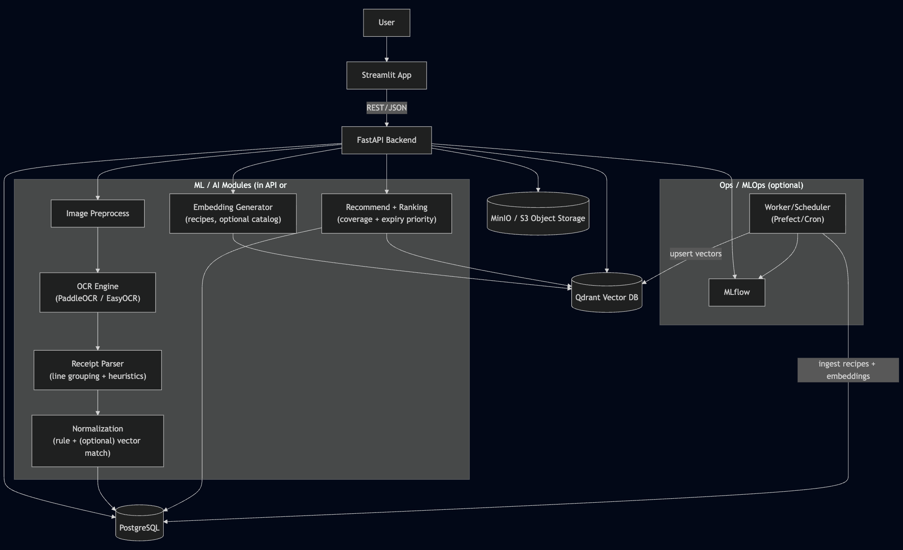
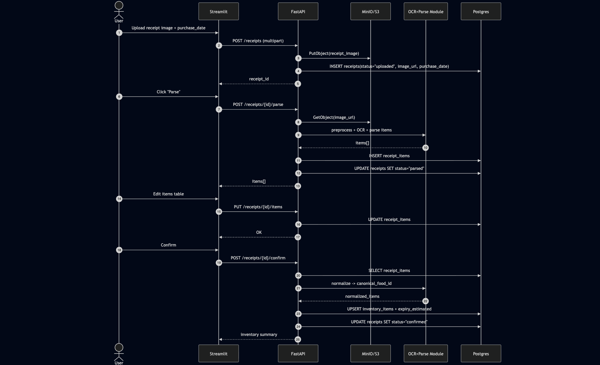
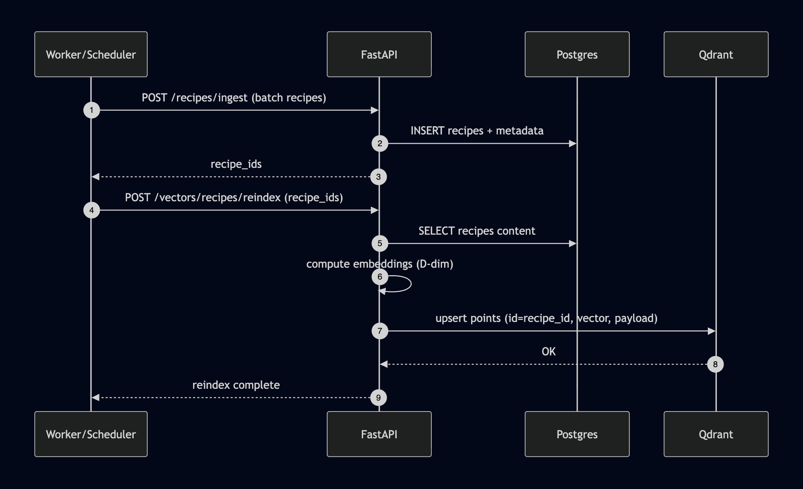
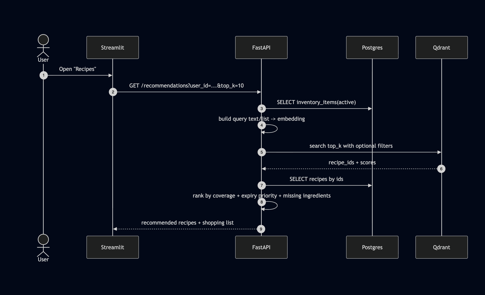

# Architecture (Qdrant-first)

## 1) Overview
MVP gồm:
- Streamlit UI
- FastAPI backend
- Postgres (business data)
- Qdrant (vectors + payload filters)
- MinIO/S3 (receipt images)
- Optional: MLflow + worker/scheduler

---

## 2) Component Diagram (Mermaid)

## 3) Sequence Diagram — Receipt Upload → Parse → Review → Confirm

## 4) Sequence Diagram — Recipe Ingest → Embed → Qdrant Upsert

5) Sequence Diagram — Recommend Recipes
